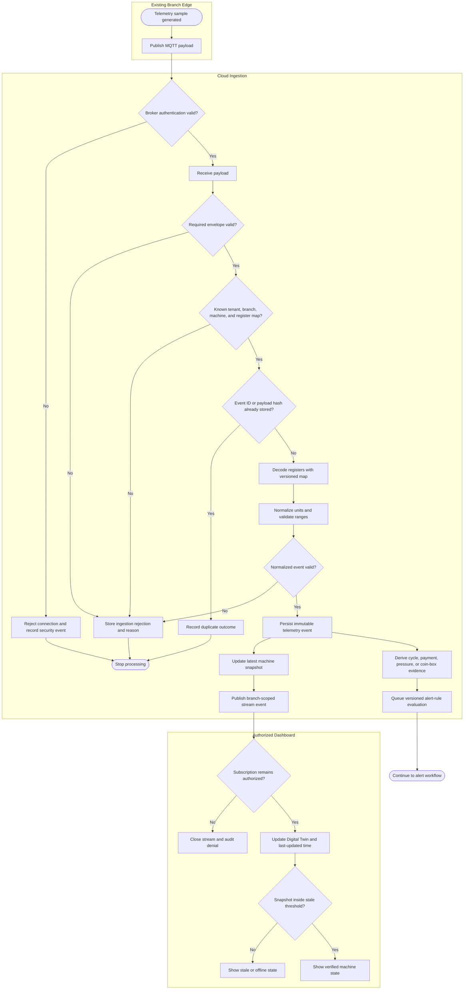
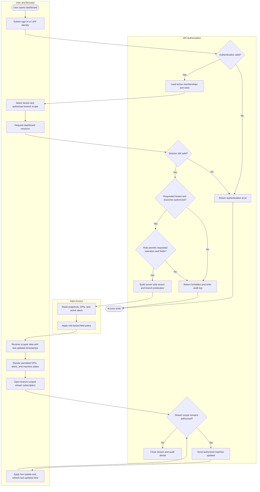
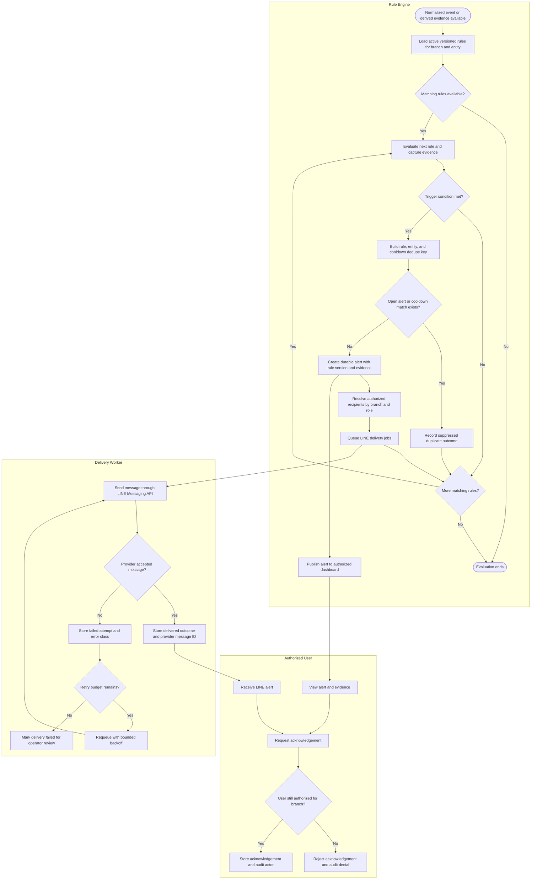
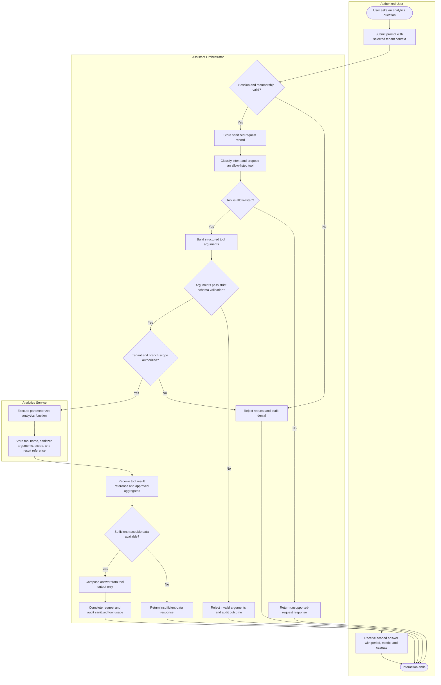

# LaundroTwin MVP Data and Activity Diagrams

This document describes the target LaundroTwin MVP. It is a logical design for
the CE Project report and future implementation; it does not claim that every
entity and workflow is already implemented by the current LaundryGo application.

## Entity Relationship Diagram

The model separates immutable source events, the latest Digital Twin snapshot,
and derived business records. This keeps KPI, alert, and AI results traceable to
versioned source data.

```mermaid
erDiagram
    TENANT ||--o{ BRANCH : owns
    TENANT ||--o{ MEMBERSHIP : grants
    USER ||--o{ MEMBERSHIP : receives
    BRANCH o|--o{ MEMBERSHIP : limits_scope

    BRANCH ||--o{ MACHINE : contains
    REGISTER_MAP ||--o{ REGISTER_DEFINITION : defines
    REGISTER_MAP ||--o{ MACHINE : configures

    TENANT ||--o{ TELEMETRY_EVENT : scopes
    BRANCH ||--o{ TELEMETRY_EVENT : receives
    MACHINE ||--o{ TELEMETRY_EVENT : emits
    REGISTER_MAP ||--o{ TELEMETRY_EVENT : decodes
    TENANT ||--o{ INGESTION_REJECTION : records
    BRANCH o|--o{ INGESTION_REJECTION : may_scope
    MACHINE ||--o| MACHINE_SNAPSHOT : has_latest
    BRANCH ||--o{ MACHINE_SNAPSHOT : scopes

    MACHINE ||--o{ MACHINE_CYCLE : runs
    BRANCH ||--o{ MACHINE_CYCLE : scopes
    MACHINE ||--o{ PAYMENT_EVENT : receives
    BRANCH ||--o{ PAYMENT_EVENT : scopes
    TELEMETRY_EVENT o|--o{ PAYMENT_EVENT : supports
    BRANCH ||--o{ GAS_SENSOR : contains
    GAS_SENSOR ||--o{ GAS_PRESSURE_EVENT : emits
    BRANCH ||--o{ GAS_PRESSURE_EVENT : scopes
    MACHINE ||--o{ COIN_BOX_ESTIMATE : has
    BRANCH ||--o{ COIN_BOX_ESTIMATE : scopes
    MACHINE ||--o{ COIN_BOX_RESET : resets
    BRANCH ||--o{ COIN_BOX_RESET : scopes
    USER o|--o{ COIN_BOX_RESET : performs

    TENANT ||--o{ ALERT_RULE : defines
    BRANCH o|--o{ ALERT_RULE : may_override
    ALERT_RULE ||--o{ ALERT_EVENT : triggers
    BRANCH ||--o{ ALERT_EVENT : scopes
    MACHINE o|--o{ ALERT_EVENT : may_target
    GAS_SENSOR o|--o{ ALERT_EVENT : may_target
    USER o|--o{ ALERT_EVENT : acknowledges
    ALERT_EVENT ||--o{ ALERT_DELIVERY : dispatches

    TENANT ||--o{ AUDIT_LOG : owns
    BRANCH o|--o{ AUDIT_LOG : may_scope
    USER o|--o{ AUDIT_LOG : acts
    TENANT ||--o{ AI_REQUEST : scopes
    USER ||--o{ AI_REQUEST : submits
    AI_REQUEST ||--o{ AI_TOOL_CALL : invokes
    TENANT ||--o{ AI_TOOL_CALL : scopes

    TENANT {
        string tenant_id PK
        string name
        string status
        datetime created_at
    }

    BRANCH {
        string branch_id PK
        string tenant_id FK
        string name
        string timezone
        string status
        datetime created_at
    }

    USER {
        string user_id PK
        string email
        string display_name
        string status
        datetime created_at
    }

    MEMBERSHIP {
        string membership_id PK
        string tenant_id FK
        string branch_id FK
        string user_id FK
        string role
        datetime granted_at
        datetime revoked_at
    }

    REGISTER_MAP {
        string register_map_id PK
        string machine_model
        string version
        string status
        datetime created_at
    }

    REGISTER_DEFINITION {
        string register_definition_id PK
        string register_map_id FK
        int register_address
        string field_name
        string data_type
        string unit
        string decode_rule
    }

    MACHINE {
        string machine_id PK
        string branch_id FK
        string register_map_id FK
        string display_name
        string machine_type
        string status
        datetime installed_at
    }

    TELEMETRY_EVENT {
        string telemetry_event_id PK
        string tenant_id FK
        string branch_id FK
        string machine_id FK
        string register_map_id FK
        datetime event_timestamp
        datetime received_at
        string payload_hash
        string data_quality_status
        string raw_payload_ref
    }

    INGESTION_REJECTION {
        string rejection_id PK
        string tenant_id FK
        string branch_id FK
        datetime received_at
        string payload_hash
        string reason_code
        string raw_payload_ref
    }

    MACHINE_SNAPSHOT {
        string machine_id PK, FK
        string branch_id FK
        string state
        int remaining_seconds
        decimal temperature_c
        string door_status
        datetime updated_at
        datetime stale_after
    }

    MACHINE_CYCLE {
        string cycle_id PK
        string branch_id FK
        string machine_id FK
        datetime started_at
        datetime ended_at
        string program_code
        int paid_satang
        string status
    }

    PAYMENT_EVENT {
        string payment_event_id PK
        string branch_id FK
        string machine_id FK
        string telemetry_event_id FK
        int amount_satang
        string payment_method
        string counter_semantics
        datetime occurred_at
    }

    GAS_SENSOR {
        string gas_sensor_id PK
        string branch_id FK
        string sensor_code
        string pressure_unit
        string status
    }

    GAS_PRESSURE_EVENT {
        string gas_pressure_event_id PK
        string gas_sensor_id FK
        string branch_id FK
        datetime event_timestamp
        decimal pressure_value
        decimal ambient_temperature_c
        string quality_status
    }

    COIN_BOX_ESTIMATE {
        string coin_box_estimate_id PK
        string branch_id FK
        string machine_id FK
        decimal estimated_fill_percent
        string calibration_version
        datetime evidence_until
        datetime updated_at
    }

    COIN_BOX_RESET {
        string coin_box_reset_id PK
        string branch_id FK
        string machine_id FK
        string performed_by_user_id FK
        string reset_source
        string source_event_id
        datetime reset_at
    }

    ALERT_RULE {
        string alert_rule_id PK
        string tenant_id FK
        string branch_id FK
        string rule_type
        string rule_version
        int cooldown_seconds
        boolean enabled
        datetime updated_at
    }

    ALERT_EVENT {
        string alert_event_id PK
        string alert_rule_id FK
        string branch_id FK
        string machine_id FK
        string gas_sensor_id FK
        string acknowledged_by_user_id FK
        string dedupe_key
        string severity
        string evidence_json
        string status
        datetime triggered_at
        datetime acknowledged_at
    }

    ALERT_DELIVERY {
        string alert_delivery_id PK
        string alert_event_id FK
        string channel
        string recipient_ref
        int attempt_number
        string delivery_status
        string provider_message_id
        datetime attempted_at
    }

    AUDIT_LOG {
        string audit_log_id PK
        string tenant_id FK
        string branch_id FK
        string actor_user_id FK
        string action
        string target_type
        string target_id
        string outcome
        datetime created_at
    }

    AI_REQUEST {
        string ai_request_id PK
        string tenant_id FK
        string user_id FK
        string prompt_redacted
        string status
        datetime requested_at
        datetime completed_at
    }

    AI_TOOL_CALL {
        string ai_tool_call_id PK
        string ai_request_id FK
        string tenant_id FK
        string tool_name
        string sanitized_arguments
        string branch_scope_json
        string result_ref
        string status
        datetime called_at
    }
```

### ER design notes

- Optional foreign keys represent records that may apply tenant-wide or may
  target different entity types. Physical migrations must make nullability and
  database constraints explicit.
- `paid_satang` and `amount_satang` are integer currency values. The meaning and
  reset behavior of a machine's paid counter must remain versioned evidence;
  the model does not assume it is universally per-cycle or lifetime cumulative.
- `COIN_BOX_ESTIMATE` is a calibrated estimate. A reset must come from a verified
  mapped event or an authorized manual action with an audit record.
- `GAS_PRESSURE_EVENT` supports low-gas trend estimation. It is not evidence of
  gas-leak detection and must not be presented as a life-safety signal.
- `MACHINE_SNAPSHOT` is replaceable latest state. Historical analysis must use
  source and derived events rather than snapshots.
- `AI_TOOL_CALL` stores allow-listed function usage and authorized scope. The
  assistant must never generate or execute arbitrary SQL.

## Activity Diagram 1: MQTT Telemetry Ingestion and Digital Twin Update

## Activity Diagram 2: Dashboard Access and Branch-Scoped RBAC

## Activity Diagram 3: Rule-Based Alert Evaluation and LINE Delivery

## Activity Diagram 4: Safe AI Executive Assistant Function Calling

## Maintenance rules

- Update the ER diagram when a durable entity, foreign key, or ownership scope
  changes.
- Update the relevant Activity diagram when an authorization, validation,
  failure, retry, or audit decision changes.
- Keep the RTM aligned with these workflows. A diagram does not replace the
  acceptance criteria in `docs/01_requirements/`.
