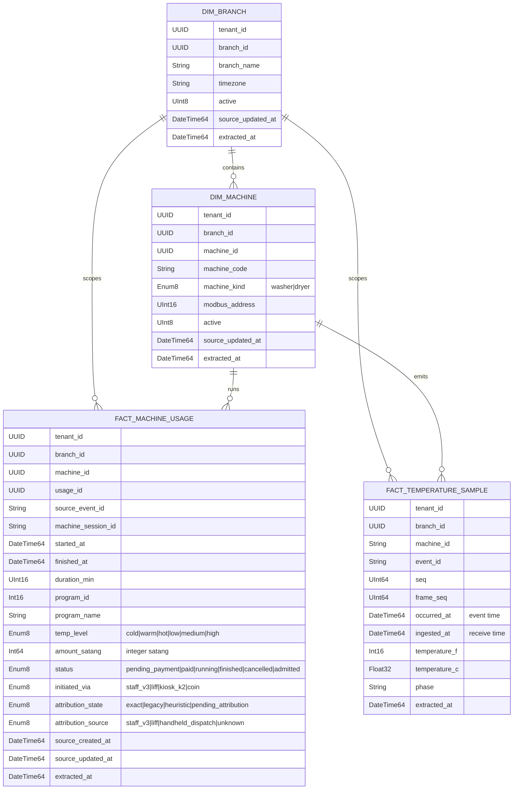

# LaundroTwin — ER Diagram of the Current Implementation (3NF)

This diagram documents the **implemented** data model (2026-09-06). It is the
physical counterpoint to the target design in `data-and-activity-diagrams.md`
(which describes the full MVP target with telemetry/register maps). Three
stores are shown:

1. **SQLite control plane** (`apps/api/src/schema.ts`, `apps/api/src/db.ts`) —
   auth, RBAC, LIFF identities, alert notifications, audit.
2. **ClickHouse analytics warehouse** (`apps/etl/src/schema.ts` on VM 117) —
   normalized dims + facts loaded by the ETL from IRIS.
3. **IRIS source (external, read-only)** — the upstream Postgres the API reads
   via the IRIS Read API (`apps/api/src/iris-read-client.ts`).

Normalization notes: every table below has a single-column surrogate PK and no
transitive dependencies; money is integer satang (`amount_satang`,
`paid_satang`); event time and receive time are separate columns
(`occurred_at` vs `ingested_at`).

## SQLite control plane

```mermaid
erDiagram
    USER ||--o{ SESSION : "has"
    USER ||--o{ ACCOUNT : "credentials"
    USER ||--o{ VERIFICATION : "challenges"
    USER ||--o{ ACCESS_GRANT : "receives"
    USER ||--o{ LIFF_IDENTITY : "linked as"
    USER ||--o{ LIFF_SESSION : "local sessions"
    USER ||--o{ LIFF_ACCESS_REQUEST : "requests"
    USER ||--o{ ALERT_ACKNOWLEDGEMENT : "acknowledges"
    USER ||--o{ AUDIT_LOG : "acts"
    USER ||--o{ ALERT_NOTIFICATION : "notified"

    SESSION {
        text id PK
        text token UK
        integer expires_at
        text user_id FK
    }
    ACCOUNT {
        text id PK
        text account_id
        text provider_id
        text user_id FK
        text password
    }
    VERIFICATION {
        text id PK
        text identifier
        text value
        integer expires_at
    }
    ACCESS_GRANT {
        text id PK
        text user_id FK
        text role "owner|manager|technician"
        text branch_id "nullable = all branches"
        integer granted_at
        integer revoked_at
    }
    LIFF_IDENTITY {
        text line_user_id PK
        text user_id FK
        text display_name
        integer updated_at
    }
    LIFF_SESSION {
        text id PK
        text token UK
        text user_id FK
        integer expires_at
    }
    LIFF_ACCESS_REQUEST {
        text id PK
        text line_user_id UK
        text display_name
        integer requested_at
        integer approved_at
        text approved_by_user_id FK
    }
    ALERT_ACKNOWLEDGEMENT {
        text id PK
        text iris_alert_id UK
        text user_id FK
        text note
        integer created_at
    }
    AUDIT_LOG {
        text id PK
        text actor_user_id FK
        text action
        text target
        text detail "JSON"
        integer created_at
    }
    ALERT_NOTIFICATION {
        text id PK
        text iris_alert_id "UNIQUE with line_user_id"
        text line_user_id "UNIQUE with iris_alert_id"
        text branch_id
        text machine_id
        text severity
        text title
        text message
        text evidence "JSON payload"
        text status "sending|sent|failed"
        text cooldown_key "branch:rule:severity"
        integer attempted_at
        integer delivered_at
        text error
    }
```

### SQLite keys and constraints (physical)

- `access_grant.branch_id` nullable = tenant-wide (owner); manager/technician
  grants carry exactly one branch. `revoked_at` null = active grant.
- `liff_identity.line_user_id` is the LINE user id (PK); it links a LINE user
  to an internal `user` row once approved.
- `alert_notification` has `UNIQUE (iris_alert_id, line_user_id)` — the
  idempotency boundary of the alert engine — plus indexes on
  `(cooldown_key, attempted_at)` and `(status, attempted_at)`.
- `alert_acknowledgement.iris_alert_id` is UNIQUE: one acknowledgement per
  upstream alert.
- `audit_log` is append-only; `detail` is a JSON string.

## ClickHouse analytics warehouse (`laundrytwin_analytics`)

Notes:

- `dim_*` tables are `ReplacingMergeTree` versioned by `source_updated_at`;
  `fact_machine_usage` is also `ReplacingMergeTree` (idempotent re-insert),
  `fact_temperature_sample` is `MergeTree` partitioned by month.
- Nulls are preserved (`Nullable(...)`); the ETL never fabricates a value.
- `amount_satang` stays integer satang until presentation (engineering
  invariant).

## IRIS source (external, read-only — not owned by LaundroTwin)

The API reads these shapes through `iris-read-client.ts` and never writes to
them:

| Envelope | Key fields (as typed) |
| :------- | :--------------------- |
| `branches` | id, code, name, timezone, status |
| `dashboard` | per-branch kpi: `revenueSatang`, `cycles`, `machineCount`, `totalCycleMinutes`, `utilization` |
| `live snapshot` | per machine: state, `remainingSeconds`, temperatureC, doorStatus, coinbox, `paidSatang`, `errorCode`, freshness |
| `alerts` | id, branchId, machineId, ruleId, `ruleVersion`, severity, title, detail, tags, evidence, `detectedAt`, `acknowledgedAt` |
| `events` | eventId, branchId, machineId, machineCode, occurredAt, kind, phase, state |

The ETL copies IRIS Postgres rows into ClickHouse (`apps/etl/src/postgres.ts`,
watermark-advanced per committed batch) so analytics never query IRIS live.

## Maintenance rules

- Update the SQLite diagram when `apps/api/src/schema.ts` changes.
- Update the ClickHouse diagram when `apps/etl/src/schema.ts` changes.
- IRIS types mirror `iris-read-client.ts`; upstream contract changes belong in
  `docs/03_data_contracts/`.
