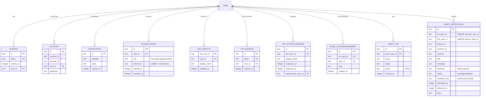

# LaundryTwin — ER Diagram of the Current Implementation (3NF)

This diagram documents the **implemented** data model (2026-09-25). It is the
physical counterpoint to the target design in `data-and-activity-diagrams.md`
(which describes the full MVP target with telemetry/register maps). Three
stores are shown:

1. **SQLite control plane** (`apps/api/src/schema.ts`, `apps/api/src/db.ts`) —
   auth, RBAC, LIFF identities, alert notifications, audit.
2. **ClickHouse analytics warehouse** (`apps/etl/src/schema.ts` on VM 117) —
   normalized dims + facts loaded by the ETL from IRIS.
3. **IRIS source (external, read-only)** — the upstream Postgres the API reads
   via the IRIS Read API (`apps/api/src/iris-read-client.ts`).

Normalization notes: every table below has a single-column surrogate PK and no
transitive dependencies; money is integer satang (`amount_satang`,
`paid_satang`); event time and receive time are separate columns
(`occurred_at` vs `ingested_at`).

## SQLite control plane

```mermaid
erDiagram
    USER ||--o{ SESSION : "has"
    USER ||--o{ ACCOUNT : "credentials"
    USER ||--o{ VERIFICATION : "challenges"
    USER ||--o{ ACCESS_GRANT : "receives"
    USER ||--o{ LIFF_IDENTITY : "linked as"
    USER ||--o{ LIFF_SESSION : "local sessions"
    USER ||--o{ LIFF_ACCESS_REQUEST : "requests"
    USER ||--o{ ALERT_ACKNOWLEDGEMENT : "acknowledges"
    USER ||--o{ AUDIT_LOG : "acts"
    USER ||--o{ ALERT_NOTIFICATION : "notified"

    SESSION {
        text id PK
        text token UK
        integer expires_at
        text user_id FK
    }
    ACCOUNT {
        text id PK
        text account_id
        text provider_id
        text user_id FK
        text password
    }
    VERIFICATION {
        text id PK
        text identifier
        text value
        integer expires_at
    }
    ACCESS_GRANT {
        text id PK
        text user_id FK
        text role "owner|manager|technician"
        text branch_id "nullable = all branches"
        integer granted_at
        integer revoked_at
    }
    LIFF_IDENTITY {
        text line_user_id PK
        text user_id FK
        text display_name
        integer updated_at
    }
    LIFF_SESSION {
        text id PK
        text token UK
        text user_id FK
        integer expires_at
    }
    LIFF_ACCESS_REQUEST {
        text id PK
        text line_user_id UK
        text display_name
        integer requested_at
        integer approved_at
        text approved_by_user_id FK
    }
    ALERT_ACKNOWLEDGEMENT {
        text id PK
        text iris_alert_id UK
        text user_id FK
        text note
        integer created_at
    }
    AUDIT_LOG {
        text id PK
        text actor_user_id FK
        text action
        text target
        text detail "JSON"
        integer created_at
    }
    ALERT_NOTIFICATION {
        text id PK
        text iris_alert_id "UNIQUE with line_user_id"
        text line_user_id "UNIQUE with iris_alert_id"
        text branch_id
        text machine_id
        text severity
        text title
        text message
        text evidence "JSON payload"
        text status "sending|sent|failed"
        text cooldown_key "branch:rule:severity"
        integer attempted_at
        integer delivered_at
        text error
    }
```

### SQLite keys and constraints (physical)

- `access_grant.branch_id` nullable = tenant-wide (owner); manager/technician
  grants carry exactly one branch. `revoked_at` null = active grant.
- `liff_identity.line_user_id` is the LINE user id (PK); it links a LINE user
  to an internal `user` row once approved.
- `alert_notification` has `UNIQUE (iris_alert_id, line_user_id)` — the
  idempotency boundary of the alert engine — plus indexes on
  `(cooldown_key, attempted_at)` and `(status, attempted_at)`.
- `alert_acknowledgement.iris_alert_id` is UNIQUE: one acknowledgement per
  upstream alert.
- `audit_log` is append-only; `detail` is a JSON string.

## ClickHouse analytics warehouse (`laundrytwin_analytics`)

```mermaid
erDiagram
    DIM_BRANCH ||--o{ DIM_MACHINE : "contains"
    DIM_BRANCH ||--o{ FACT_MACHINE_USAGE : "scopes"
    DIM_MACHINE ||--o{ FACT_MACHINE_USAGE : "runs"
    DIM_BRANCH ||--o{ FACT_TEMPERATURE_SAMPLE : "scopes"
    DIM_MACHINE ||--o{ FACT_TEMPERATURE_SAMPLE : "emits"
    DIM_BRANCH ||--o| DIM_BRANCH_LOCATION : "weather source location"
    DIM_BRANCH ||--o{ FACT_WEATHER_SAMPLE : "scopes"

    DIM_BRANCH {
        UUID tenant_id
        UUID branch_id
        String branch_name
        String timezone
        UInt8 active
        DateTime64 source_updated_at
        DateTime64 extracted_at
    }
    DIM_MACHINE {
        UUID tenant_id
        UUID branch_id
        UUID machine_id
        String machine_code
        Enum8 machine_kind "washer|dryer"
        UInt16 modbus_address
        UInt8 active
        DateTime64 source_updated_at
        DateTime64 extracted_at
    }
    FACT_MACHINE_USAGE {
        UUID tenant_id
        UUID branch_id
        UUID machine_id
        UUID usage_id
        String source_event_id
        String machine_session_id
        DateTime64 started_at
        DateTime64 finished_at
        UInt16 duration_min
        Int16 program_id
        String program_name
        Enum8 temp_level "cold|warm|hot|low|medium|high"
        Int64 amount_satang "integer satang"
        Enum8 status "pending_payment|paid|admitted|running|finished|cancelled"
        Enum8 initiated_via "staff_v3|liff|kiosk_k2|coin"
        Enum8 attribution_state "exact|legacy|heuristic|pending_attribution"
        Enum8 attribution_source "staff_v3|liff|handheld_dispatch|unknown"
        DateTime64 source_created_at
        DateTime64 source_updated_at
        DateTime64 extracted_at
    }
    FACT_TEMPERATURE_SAMPLE {
        UUID tenant_id
        UUID branch_id
        String machine_id
        String event_id
        UInt64 seq
        UInt64 frame_seq
        DateTime64 occurred_at "event time"
        DateTime64 ingested_at "receive time"
        Int16 temperature_f
        Float32 temperature_c
        String phase
        DateTime64 extracted_at
    }
    DIM_BRANCH_LOCATION {
        UUID tenant_id
        UUID branch_id
        String province
        Nullable String sub_district
        Nullable String district
        Float64 lat
        Float64 lon
        UInt32 version
    }
    FACT_WEATHER_SAMPLE {
        DateTime64 timestamp
        UUID tenant_id
        UUID branch_id
        Nullable String province
        Nullable String sub_district
        Nullable String district
        Nullable Float32 weather_temp_c
        Nullable Float32 weather_humidity_pct
        Nullable Float32 weather_rain_mm
        Nullable Int32 weather_cond
    }
```

Notes:

- `dim_*` tables are `ReplacingMergeTree` versioned by `source_updated_at`;
  `fact_machine_usage` is also `ReplacingMergeTree` (idempotent re-insert),
  `fact_temperature_sample` is `MergeTree` partitioned by month.
- `fact_weather_sample` (F-12) is `ReplacingMergeTree` keyed by
  `(tenant_id, branch_id, timestamp)` — a re-run converges to one observation
  per registered branch and timestamp. Its nullable weather and position
  fields stay NULL when source data is missing; they are never fabricated.
- `dim_branch_location` is **ops-provisioned** (province/sub_district/district/lat/lon per branch)
  and NOT written by the ETL — `dim_branch` itself is IRIS-mirrored and any
  manual column there gets overwritten with NULL on the next sync. The weather
  collector joins `dim_branch_location` × `dim_branch active=1` for targets.
- Nulls are preserved (`Nullable(...)`); the ETL never fabricates a value.
- `FACT_MACHINE_USAGE.machine_session_id` is `Nullable(String)` in the
  warehouse and the ETL copies it straight through from IRIS
  `attribution_machine_session_id` (`apps/etl/src/postgres.ts:141`,
  `apps/etl/src/transform.ts:194`). Its cardinality was measured on 2026-09-29
  against the real warehouse (4,458 non-synthetic rows, 2026-07-22 → 2026-09-25):
  **one row per session and one status per session**. The id is absent on the
  majority of rows — currently ~68%, a live metric whose current value is in
  `docs/06_ml/ml-training-data-guide.md` §9.1 — and that absent set is
  essentially the `attribution_state = 'pending_attribution'` set. The 1:1
  session cardinality was **not re-measured** after the 2026-09-30 recovery
  merge. No counter uses it to count cycles —
  the canonical cycle count is the row count
  `countIf(status IN ('paid', 'finished'))` — and it is used only to report how much of
  that count carries session-level evidence (`dashboard.cycleAttribution`). Its
  upstream meaning remains **unresolved**; no meaning is asserted here. See
  "Canonical cycle definition" in `docs/04_traceability/RTM_matrix.md` and
  "Session Attribution" in `docs/03_data_contracts/data_contracts.md`.
- `paid` vs `finished` are **provably distinct** (resolved 2026-09-29 from
  `Meepain-group/iris-project` @ `813ffa7`; see `docs/03_data_contracts/data_contracts.md`,
  "`status` enum numbering"). They are two distinct `FACT_MACHINE_USAGE.status`
  enum members, and the API reports them as two distinct `machines[].status`
  values on `/api/twin` and `/api/report/live` (`"paid"` and `"finished"`; also
  `"cancelled"`, `"admitted"`, `"pending"`, `"idle"`, `"offline"`, `"unknown"`,
  `"running"`). They were previously collapsed into `"paid"`, which made the
  documented `paid_ratio` feature meaningless. `active-machine-usage.ts:22`
  counts `paid` as in-progress; `finished` requires `last_phase = 'IDLE'`
  (migration `0053:41-44`); and nothing sweeps a `paid` row that never receives
  a session-end event, so a `paid` row can persist indefinitely. Revenue and
  cycle aggregation is unchanged and still counts both, now written by name —
  `status IN ('paid', 'finished')` in `apps/api/src/report/clickhouse-report.ts`,
  `status IN ('finished','paid')` in `apps/api/src/analytics/queries.ts`. A KPI
  may not equate the two, and `amount_satang` is a pre-set program price, not
  proof of settlement.
- `dashboard.usageRowsInRange` (`apps/api/src/report/clickhouse-report.ts`) is
  the presence signal: the number of usage rows in range within the resolved
  branch scope, `0` when there are none, `null` when the source cannot count
  them (the IRIS/demo projection). It is deliberately **not** folded into
  `availability`, which is a provenance axis ("how do I know this?").
- Current direct Dashboard and Digital Twin reports use ClickHouse usage data;
  they retain active inventory, preserve unknown state, and expose usage-derived
  freshness. `fact_machine_event` is empty, so these routes are not live
  telemetry. Local code/tests cover the boundaries, but production E2E remains
  pending.

## IRIS source (external, read-only — not owned by LaundryTwin)

The API reads these shapes through `iris-read-client.ts` and never writes to
them:

| Envelope | Key fields (as typed) |
| :------- | :--------------------- |
| `branches` | id, code, name, timezone, status |
| `dashboard` | per-branch kpi: `revenueSatang`, `cycles`, `machineCount`, `totalCycleMinutes`, `utilization` (`number \| null` — a count is present, the ratio may not be computable) |
| `live snapshot` | per machine: state, `remainingSeconds`, temperatureC, doorStatus, coinbox, `paidSatang`, `errorCode`, freshness |
| `alerts` | id, branchId, machineId, ruleId, `ruleVersion`, severity, title, detail, tags, evidence, `detectedAt`, `acknowledgedAt` |
| `events` | eventId, branchId, machineId, machineCode, occurredAt, kind, phase, state |

The ETL copies IRIS Postgres rows into ClickHouse (`apps/etl/src/postgres.ts`,
watermark-advanced per committed batch) so analytics never query IRIS live.

## Maintenance rules

- Update the SQLite diagram when `apps/api/src/schema.ts` changes.
- Update the ClickHouse diagram when `apps/etl/src/schema.ts` changes.
- IRIS types mirror `iris-read-client.ts`; upstream contract changes belong in
  `docs/03_data_contracts/`.
