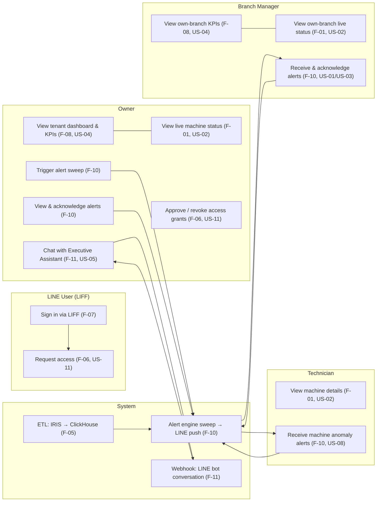
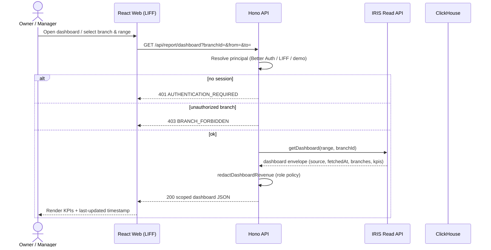
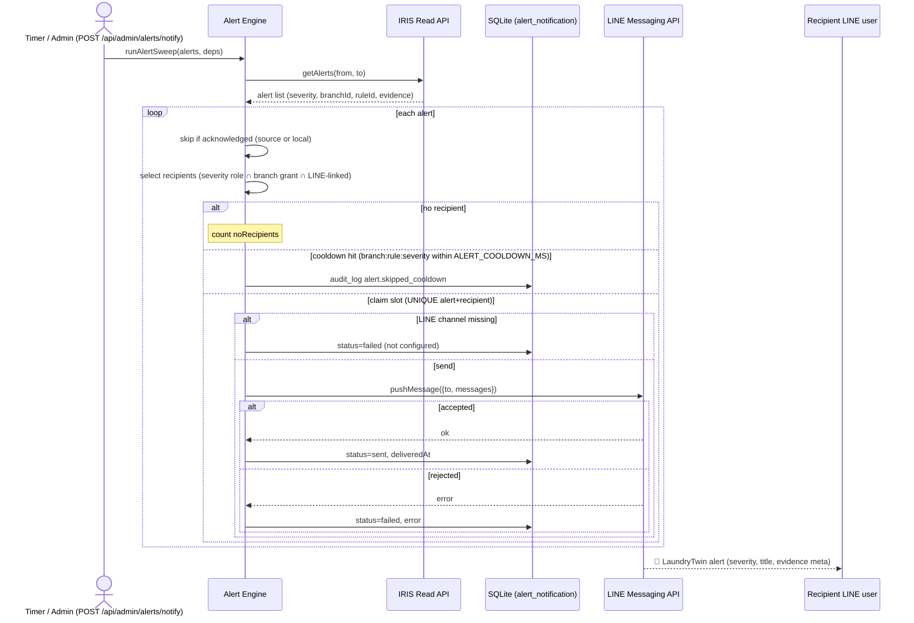
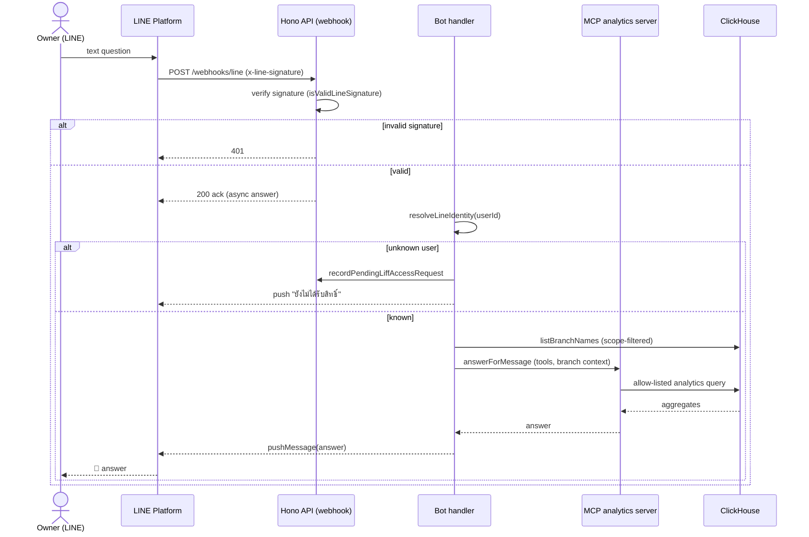

# LaundroTwin MVP — Use Case and Sequence Diagrams

Scope: the **current implementation** (read-only LINE LIFF reporting surface,
RBAC, ClickHouse analytics, MCP assistant, LINE bot, alert engine). The target
design's activity flows live in `data-and-activity-diagrams.md`; where this
document and that one differ, this document describes what the code actually
does today.

## Actors

| Actor | Description | Related roles |
| :---- | :---------- | :------------- |
| **Owner** | Franchise owner. Tenant-wide access, manages access grants, receives all severities. | `owner` |
| **Branch Manager** | Operates one assigned branch; sees branch KPIs and alerts. | `manager` |
| **Technician** | Diagnoses machines; receives machine-related alerts. | `technician` |
| **LINE User (LIFF)** | Approached via LINE LIFF; must be linked to an approved account to see the dashboard. | `liff_identity` |
| **LINE Platform** | LINE Messaging API / LIFF infrastructure (webhook push, message delivery). | external |
| **IRIS Read API** | Upstream read-only source of branches, machines, cycles, alerts, events. | external |
| **ClickHouse** | LaundryTwin analytics warehouse (dim + fact tables). | external |

## Use Case Diagram



## Use Case Descriptions

### UC-01: View branch dashboard and KPIs (F-08, US-04)
- **Primary actor:** Owner, Branch Manager
- **Preconditions:** Authenticated session; principal resolved; grant covers the branch.
- **Flow:** Actor selects branch/time range → API authorizes via `canAccessBranch` → aggregates queried from ClickHouse → response envelopes data source + freshness (`analyticsEnvelope`).
- **Postconditions:** Owner sees tenant totals; manager sees only assigned branch; revenue hidden for non-owner/manager roles (`redactDashboardRevenue`).
- **Failure:** 401 no session; 403 branch forbidden; 503 analytics source unavailable.

### UC-02: View live machine status (F-01, US-02)
- **Primary actor:** Owner, Branch Manager, Technician
- **Flow:** Actor requests `/api/report/live` for a single branch → `iris.getLiveSnapshot` → machines with state, remainingSeconds, temperatureC, freshness (`fresh`/`stale`/`unavailable`).
- **Postconditions:** Missing/stale values preserved as null or flagged — never fabricated.
- **Failure:** 400 when no branch selected for non-owner; 403 for unauthorized branch.

### UC-03: Chat with the Executive Assistant (F-11, US-05)
- **Primary actor:** Owner (LINE bot)
- **Flow:** LINE text message → webhook signature verified → identity resolved → prompt + branch context sent to assistant → assistant calls allow-listed MCP analytics tools → answer pushed back.
- **Postconditions:** Only allow-listed tools executed; branch scope enforced; busy-set drops overlapping requests.
- **Failure:** unknown LINE user → access-request recorded + guidance message; LLM error → apologetic fallback message.

### UC-04: Approve / revoke access grants (F-06, US-11)
- **Primary actor:** Owner
- **Flow:** Owner lists pending LIFF requests → approves with role + branch (or revokes a grant) → `access_grant` row written; audit log entry appended.
- **Constraints:** owner is tenant-wide (branchId null); manager/technician require exactly one branch; last-owner grant cannot be revoked.

### UC-05: Receive and acknowledge alerts (F-10, US-01/US-03/US-08)
- **Primary actor:** Owner, Branch Manager, Technician
- **Flow:** Alert sweep fetches IRIS alerts → engine selects recipients by severity role + branch → LINE push (idempotent per alert+recipient, cooldown per class) → dashboard shows alerts with acknowledged state; actor acknowledges → `alert_acknowledgement` row + audit.
- **Postconditions:** At most one push per (alert, recipient); repeat occurrences suppressed by cooldown key `branch:rule:severity`; every attempt audited in `alert_notification`.

### UC-06: Request access from LIFF (F-06, US-11)
- **Primary actor:** LINE User (LIFF)
- **Flow:** Unknown user exchanges LINE ID token → `liff_access_request` pending row created → owner approves (UC-04) → `liff_identity` + grant created; subsequent sign-in resolves a real principal.

## Sequence Diagrams

### SD-1: Dashboard report fetch (RBAC-scoped)



### SD-2: Alert engine sweep → LINE push



### SD-3: LINE bot conversation (Executive Assistant)



### SD-4: LIFF access approval

```mermaid
sequenceDiagram
    actor U as LINE user (new)
    actor O as Owner
    participant W as React Web (LIFF)
    participant A as Hono API
    participant D as SQLite

    U->>W: Open LIFF app (LINE ID token)
    W->>A: POST /api/auth/liff/exchange {idToken}
    A->>A: verifyLiffIdToken (channel ID)
    alt unknown user
        A->>D: insert liff_access_request (pending)
        A-->>W: 403 ACCESS_PENDING
    else known + granted
        A->>D: create liff_session
        A-->>W: 200 {user, roles}
    end
    O->>A: GET /api/admin/access-requests (owner)
    A-->>O: pending list
    O->>A: POST /api/admin/access-requests/:id/approve {role, branchId}
    A->>A: validate role/branch rules
    A->>D: create liff_identity + access_grant; audit access_request.approved
    A-->>O: 200 {user}
```

## Maintenance rules

- Update SD-1 when report authorization or the IRIS contract changes.
- Update SD-2 when alert dedup/cooldown semantics change (also see
  `apps/api/src/alert-engine.ts` and its tests).
- Keep actors aligned with `access-policy.ts` roles (`owner`, `manager`, `technician`).
